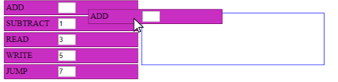

# PRÁCTICA: PROCESADOR C5I

Para realizar esta práctica se usará el **procesador c5i**: (se encuentra más abajo)

*El procesador c5i* es un procesador que nos hará entender de una manera sencilla el funcionamiento de un ordenador. Una sociedad cada vez más informatizada, en la cual la industria 4.0 es una realidad, requiere prácticamente de todo profesional cierta destreza a la hora de emplear sistemas informáticos. Para ello, el fin de esta práctica consiste en mostrar de una manera sencilla el comportamiento general de un ordenador mediante el uso del procesador c5i.

### FUNCIONAMIENTO DEL PROGRAMA

### COMANDOS

El programa a utilizar dispondrá de 5 diferentes comandos:

| Comando | Descripción |
| ----- | ----- |
| **1-Sumar:** | El procesador **leerá** el número que aparece en la **casilla indicada**  por el usuario y lo **sumará** al existente en la **pantalla de respuesta**. Además **anotará** la acción de la siguiente manera: En la primera casilla vacía que encuentre marcará que ha ejecutado la acción **1 (restar)** y en la segunda anotará **el número que se ha sumado**. |
| **2-Restar:** | El procesador **leerá** el número que aparece en la **casilla indicada** por el usuario y lo **restará** al existente en la **pantalla de respuesta**. Además **anotará** la acción de la siguiente manera: En la primera casilla vacía que encuentre marcará que ha ejecutado la acción **2 (restar)** y en la segunda anotará el **número que se ha restado**. |
| **3-Leer:** | El procesador **leerá** el número que aparece en la **casilla indicada** por el usuario y lo **sobrescribirá** en la **pantalla de respuesta**. Además **anotará** la acción de la siguiente manera: En la primera casilla vacía que encuentre marcará que ha ejecutado la **acción 3 (leer)** y en la segunda anotará el **número que se ha leído**. |
| **4-Escribir:** | El procesador **leerá** el número que aparece en la **pantalla de respuesta** y lo **escribirá** en la **casilla indicada^** por el usuario. Además **anotará** la acción de la siguiente manera: En la primera casilla vacía que encuentre marcará que ha ejecutado la acción **4 (escribir)** y en la segunda anotará el **número que se ha escrito**. |
| **5-Saltar:** |Si el registro es 0, salta a la instrucción indicado en la dirección de memoria |

## PRÁCTICA

<iframe width="660" height="550" src="https://Pauandalt.github.io/TFG-Practica-c5i/c5i-ui.html" frameborder="1" allowfullscreen></iframe>

### Ejercicio 1: Sumar dos números
Escriba el número 12 en la casilla 10 y el número 9 en la casilla 70. Usando el comando *Add* del procesador c5i, sume las casillas deseadas escribiendo en el recuadro que ofrece el comando el número de la casilla (10 en el primer caso y 70 en el segundo).

### Ejercicio 2: Restar dos números
Escriba el número 12 en la casilla 10 y el número 9 en la casilla 70. Usando el comando *Substract* del procesador c5i, sume las casillas deseadas escribiendo en el recuadro que ofrece el comando el número de la casilla (10 en el primer caso y 70 en el segundo).

### Ejercicio 3: Sumar dos números y escribir la respuesta en la casilla deseada:
Escriba ahora el número 7 en la casilla 42 y el número 18 en la casilla 49. Ejecute un programa que sume estas dos cifras y escriba la respuesta en la casilla 99. Compruebe que el resultado es correcto.

### Ejercicio 4: Restar dos números y escribir la respuesta en la casilla deseada:
Escriba 0 en la casilla de respuesta. Manteniendo los números del ejercicio anterior, ejecute la siguiente operación: Casilla 49- casilla 42. Escriba la respuesta en la casilla 99. Compruebe que el resultado es correcto.

